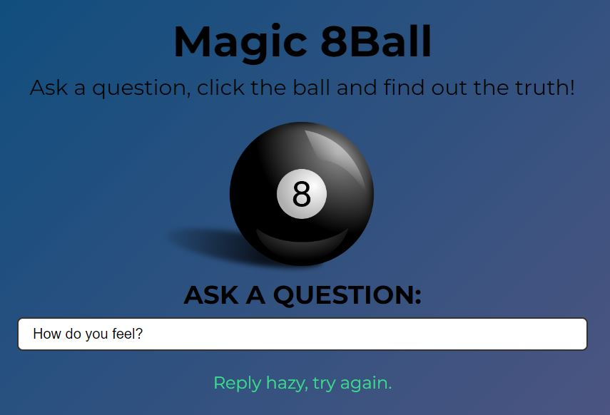

# Magic 8 Ball
Magic 8 Ball is an application that allows you to ask any question to the "Magic Ball"
In response to your question "Magic Ball" randomly selecting an answer. 

You can see this project here: https://szymonsauer.github.io/magic-8ball/

* [General info](#general-info)
* [Technologies](#technologies)
* [Screenshots](#screenshots)
* [Setup](#setup)
* [Status](#status)
* [Inspiration](#inspiration)

## General info
I made this project to practice my skills related to JavaScript and web creating. 

## Technologies
Project is created with:
* HTML5
* CSS3
* JavaScript

## Screenshots

## Setup
You can see this project on-line using link: https://szymonsauer.github.io/weather-app/
To run this project locally download the code and run in the Visual Studio Code program. 

## Status
Program based on MMC course '[2024] 10 projektów w czystym JavaScript!'
